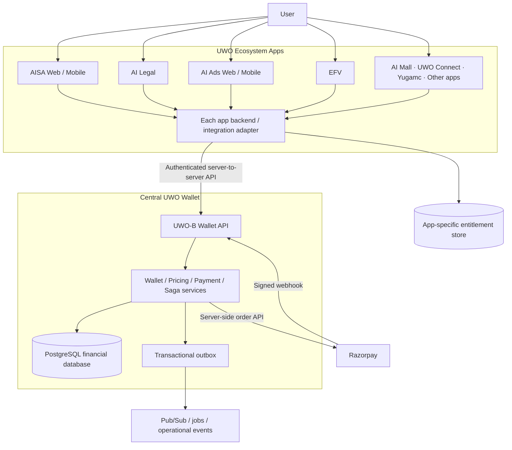
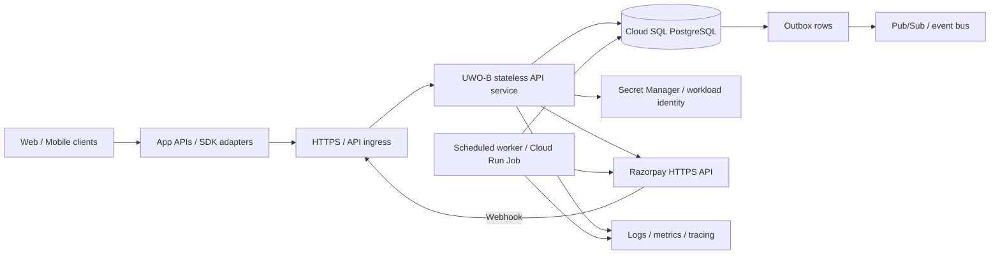
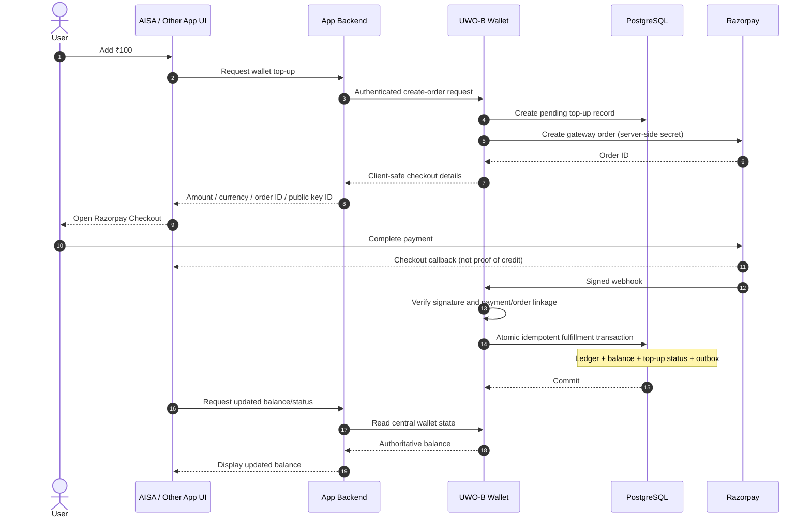
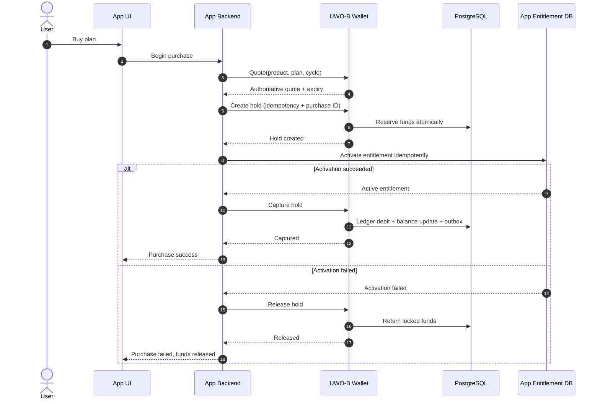

# UWO UNIFIED WALLET

## Greenfield Architecture & Implementation Specification

**Version 1.0 | 09 October 2026 | Antigravity Source of Truth**


## 0. Purpose, scope and assumptions

This document is the single implementation specification for creating UWO Unified Wallet integration in fresh UWO ecosystem projects where wallet integration is not present. Treat this as a greenfield wallet implementation and integration—not an audit or continuation of previously generated wallet code.

**Starting assumption:** app repositories and their existing login/subscription features may already exist, but wallet code, wallet data models, wallet payment routes, and wallet SDK integration must be treated as absent until verified in the fresh workspace. Do not rely on previous reports or assume old wallet files, tests, routes, database rows, credentials, or deployment settings still exist.

**Goal:** build one central UWO Wallet platform and integrate every approved app so users share one monetary balance and transaction history across AISA, AI Legal, AI Ads, EFV, AI Mall, UWO Connect, Yugamc, FlowAI, Studio and future UWO apps.

**Financial rule:** Razorpay wallet top-up order creation, payment verification, webhook handling, fulfillment, refunds and reconciliation belong only to the central UWO Wallet backend (UWO-B). Individual app backends must not implement their own wallet top-up payment pipelines or maintain authoritative rupee balances.

**Existing identity rule:** reuse the established UWO unified-login identity where available. Do not rewrite every app's login implementation as part of this project. Every app must map the authenticated user to one immutable canonical `uwo_user_id`. If no reliable cross-app identity mapping exists, stop and document the minimal approved identity adapter before enabling wallet transactions.

**Suggested deployment direction:** Node.js/Express UWO-B, PostgreSQL as the financial source of truth, GCP Cloud Run + Cloud SQL + Secret Manager + Cloud Logging/Monitoring where consistent with the actual infrastructure. Confirm exact runtime versions, region, repository paths, secrets, domains and deployment strategy from the fresh workspace before configuring production.

**Implementation principle:** discover each fresh repository first, then implement incrementally with tests. Do not overwrite app behavior, prices, login or subscription rules that are outside wallet scope.


## 1. Required business behavior

A user has one central UWO wallet, not one independent wallet per app.

**Shared balance example**
1. The user opens AISA and chooses Add Money ₹100.
2. AISA requests a wallet top-up order from UWO-B.
3. UWO-B creates the Razorpay order; the browser/mobile app displays Razorpay Checkout.
4. After verified payment, UWO-B credits the central wallet once.
5. AISA and AI Legal both read ₹100 for the same canonical user.
6. The user purchases a ₹30 eligible product in AI Legal.
7. UWO-B authorizes and records the debit centrally; the balance is ₹70.
8. AISA, AI Legal, AI Ads and other approved apps display ₹70 after refresh.

A short UI cache delay is acceptable; a separate or independently mutable balance is not.

**Shared product rules**
- One wallet per canonical UWO user for the initial product model.
- One central financial ledger and transaction history.
- An app may initiate a wallet operation but cannot decide that money was paid or credited.
- All prices for app plans/products are resolved by UWO-B's authoritative catalog. Clients send product identifiers, plan, billing cycle and quantity—not trusted rupee prices.
- App-specific subscriptions, quotas, visual credits, usage counts and features remain owned by the app that provides them.


## 2. Target system architecture



### Component responsibility map

| Component | Owns | Must not own |
|---|---|---|
| UWO-B Wallet API | Wallet balances, pricing catalog, quotes, holds, capture/release, top-ups, payment verification, refunds, reconciliation, financial ledger | App-specific quotas/features |
| PostgreSQL / Cloud SQL | Authoritative wallet and financial state; atomic mutations | UI state or application entitlement rules |
| Razorpay | Payment gateway processing and checkout | UWO wallet ledger / wallet balance |
| App backend | App workflow, entitlements, subscription activation, usage enforcement; wallet adapter calls | Wallet source of truth or independent Razorpay top-up pipeline |
| Web/mobile UI | Display central balance/history and initiate allowed flows | Secrets, payment proof or authoritative balance mutation |
| MongoDB/app datastore | App entitlements, logs, telemetry, raw webhook archive if useful | Authoritative wallet money or ledger |

**Trust boundary:** frontend -> app backend -> UWO-B is the default. Razorpay webhooks go directly to UWO-B. User-scoped direct calls to UWO-B are permitted only if a deliberate delegated-auth model is documented and tested; never expose service credentials to a client.


## 3. Logical deployment architecture



Deployment guidance:
- Keep API instances stateless. Use PostgreSQL transactions as the financial consistency boundary; do not rely on in-memory locks.
- Use Cloud SQL PostgreSQL with private connectivity and backups/PITR enabled where supported by the chosen service configuration.
- Use Secret Manager or workload identity for service credentials; do not store secrets in source control or client bundles.
- Separate development, staging and production projects/secrets/DBs.
- Run webhook, outbox, reconciliation and hold-expiry processing through durable workers or scheduled jobs; jobs must be idempotent.
- Select region, high availability, networking and service sizing only after confirming the actual UWO environment and latency/cost requirements.


## 4. Identity, accounts and app authorization

The identity model is critical to sharing one wallet safely.

### Canonical identifiers
- `uwo_user_id`: immutable UWO identity for a person/account.
- `wallet_id`: central wallet record.
- `app_id`: registered ecosystem application identifier such as `aisa`, `ai_legal`, `ai_ads`, `efv`.
- `service_id`: backend service identity for trusted server-to-server actions.
- `purchase_id`, `quote_id`, `hold_id`, `topup_order_id`, `ledger_id`, `trace_id`: stable operation references.

### Rules
1. One canonical `uwo_user_id` maps to one wallet in v1.
2. Do not key wallets by email, display name or phone number. These can change or be unverified.
3. Derive a user from a verified authentication token/session. Reject requests where a body user ID conflicts with the authenticated subject.
4. Every quote, hold, top-up order, transaction history row and refund must be checked against the canonical user and wallet.
5. Register each app and app backend. Server-to-server calls authenticate the service and enforce that service's registered app scope.
6. App identity does not give access to all users' wallets; every request must carry validated user context/delegation.
7. Do not accept ID prefixes (for example `hld_` or `led_`) as proof of authorization.
8. If fresh projects cannot resolve the same immutable canonical identity across apps, pause wallet writes until an approved identity mapping/adapter is implemented.

Do not rebuild the unified-login product as part of the wallet feature. Integrate using the existing identity provider and add only the minimum verified mapping needed.


## 5. Centralized Razorpay architecture

**UWO-B is the only Razorpay wallet top-up authority.** It creates orders, verifies provider notifications, fulfills wallet credits, reconciles state and owns refund orchestration.

Downstream app backends must not create separate Razorpay top-up orders, hold Razorpay secret/webhook credentials, make client callbacks authoritative, or credit wallet money locally.

### Top-up sequence



### Mandatory payment rules
- Keep Razorpay Key Secret and webhook secret in server-side secret storage owned by UWO-B. Only the public Key ID may be exposed where required for Checkout.
- Create an internal top-up record bound to canonical user, wallet, app, expected amount in paise, currency, gateway order ID, idempotency key and trace ID.
- Verify webhook signatures using the exact raw request body as required by the provider integration.
- Validate payment status, order linkage, amount, currency and internal order status before crediting.
- The browser/mobile callback only triggers status refresh; it never credits funds.
- Handle duplicate, delayed and out-of-order webhook events idempotently.
- Do not credit an amount from an untrusted request body.
- Reconciliation may recover verified missed events by using the same idempotent fulfillment path.
- If the result is uncertain, display pending status and reconcile rather than creating duplicate orders blindly.

### API route contract (canonical proposal)
- `POST /api/v1/wallet/topup-orders` — create a Razorpay order for an authenticated user.
- `GET /api/v1/wallet/topup-orders/{topupOrderId}` — user-scoped status.
- `POST /api/v1/payments/razorpay/webhook` — central Razorpay webhook endpoint.
- `POST /api/v1/wallet/refunds` — restricted internal/admin operation if refunds are supported.
- No public client endpoint may grant wallet credit from a client assertion.

The canonical webhook route must be identical in UWO-B routing, provider dashboard, deployment configuration, tests and operations runbook. Antigravity must verify the real mounted path before configuration.


## 6. Wallet balances, buckets and financial ledger

### Recommended v1 model
Use separate cash and promotional buckets because they have different sources and refund/expiry rules.

- **Cash balance:** funds purchased by the user through verified payment.
- **Promo balance:** promotional grants explicitly issued under a recorded policy.
- **Locked funds:** funds reserved by active holds.
- **Available balance:** funds eligible for a new hold.
- **Total balance:** must be defined consistently with the database model; typically available + locked.

For eligible spend, the baseline discussed for UWO is **FIFO promo-first spend**, then cash. Implement that rule centrally and cover it with tests. Promo grants must have their own explicit source, expiry/eligibility rules and ledger reference.

Refund policy must be explicit before live launch. A gateway refund is not the same as a simple balance update: the refund flow must link to the original successful payment and ledger reference, prevent over-refunds, and record whether the funds are refundable cash or non-refundable promotional funds. Never convert promo balance into cash. No downstream app defines refund bucket behavior.

### Ledger contract
- Append-only immutable financial ledger; do not update/delete posted entries.
- Corrections require compensating entries with reason, operator/actor, original reference and trace ID.
- Use integer paise and explicit currency code (INR for v1 unless multi-currency is separately designed).
- Unique constraints prevent repeated top-up fulfillment, provider payment reuse, repeated capture and duplicate idempotency requests.
- Financial changes and matching ledger/outbox entries commit in one PostgreSQL transaction.
- Enforce non-negative balance constraints in application logic and database constraints where practical.

### Required invariants
- Cash balance reconciles to cash ledger postings.
- Promo balance reconciles to promo ledger postings.
- No negative bucket or available balance.
- Total/available/locked relationships always reconcile.
- A top-up credits no more than once.
- A hold captures no more than once; a released hold cannot capture.
- A posted financial mutation always has its ledger/audit reference and outbox record.
- All balance-changing paths serialize safely under concurrency.


## 7. Database design (logical schema)

The exact SQL DDL should be written as reviewed migrations; these are required logical entities. Do not add parallel copies of an entity.

| Entity | Purpose / important fields |
|---|---|
| `wallets` | `wallet_id`, unique `uwo_user_id`, currency, cash/promo balances or bucket representation, locked/available representation, status, version, timestamps |
| `wallet_ledger` | immutable `ledger_id`, wallet/user, direction/type, amount paise, bucket split, reference type/ID, app ID, purchase ID, idempotency key, trace ID, actor/source, timestamp |
| `topup_orders` | internal ID, wallet/user/app IDs, gateway order/payment IDs, expected cash amount paise, currency, status, idempotency key, fulfillment source, trace ID |
| `wallet_quotes` | quote ID, product/plan/cycle, authoritative amount/currency, catalog version, expiry, integrity protection and user/app binding where appropriate |
| `wallet_holds` | hold ID, wallet/user/app, quote ID, purchase reference, amount and bucket allocation, state, idempotency key, expiry, trace ID |
| `payment_webhook_events` | provider event ID, payload or secure reference, signature result, processing status, retries, timestamps |
| `outbox_events` | event ID, aggregate/reference ID, event type, payload, publish status, retry state, timestamps |
| `idempotency_records` | scope, key, request hash, result/reference and replay response |
| `refund_records` | provider refund ID, original payment/ledger reference, amount, status, reason and idempotency key |

### Database requirements
- PostgreSQL is the only financial source of truth. MongoDB can hold app entitlements, telemetry and operational logs, not balances/ledger.
- Use foreign keys and unique/check constraints where appropriate.
- Use transactions and row locks or an equivalent proven serialization strategy for contested wallet operations.
- Decide and enforce one global lock ordering to reduce deadlocks; document it in code and tests.
- Add explicit state machines for top-ups, holds, captures, releases and refunds.
- Run migrations only through controlled deployment; do not mutate production schema manually.
- Enable backups and test recovery before real-money launch.


## 8. API contract

The following is the target v1 logical API. Antigravity should implement an OpenAPI specification and use consistent naming/status/error semantics. Routes must be versioned and have no duplicate prefix.

| Method | Endpoint | Purpose | Caller |
|---|---|---|---|
| `GET` | `/api/v1/wallet/me` | Current user's central wallet summary | User-authenticated app backend |
| `GET` | `/api/v1/wallet/transactions` | Paginated central transaction history | User-authenticated app backend |
| `POST` | `/api/v1/wallet/topup-orders` | Create central Razorpay order | App backend through user-authorized context |
| `GET` | `/api/v1/wallet/topup-orders/{id}` | Read top-up status | User-authorized context |
| `POST` | `/api/v1/payments/razorpay/webhook` | Signed gateway webhook | Razorpay |
| `POST` | `/api/v1/wallet/quotes` | Request central price quote | App backend service identity |
| `POST` | `/api/v1/wallet/holds` | Reserve spendable funds | App backend service identity |
| `POST` | `/api/v1/wallet/holds/{id}/capture` | Capture hold after entitlement activation | App backend service identity |
| `POST` | `/api/v1/wallet/holds/{id}/release` | Release hold on failure | App backend service identity |
| `GET` | `/api/v1/wallet/holds/{id}` | Query hold state for safe recovery | Authorized app backend |
| `POST` | `/api/v1/wallet/refunds` | Request controlled refund | Restricted backend/admin policy |

### API contracts
- Quote requests specify product, plan, billing cycle, quantity and app ID. The server resolves the price; the client cannot submit a trusted amount.
- Balance and transaction history derive the canonical user from verified auth; do not allow arbitrary user IDs.
- Every mutation must include/derive idempotency key, `trace_id`, `app_id`, and `purchase_id` as relevant.
- Capture/release endpoints validate record ownership, amount, app, purchase and state, not just the ID string.
- Webhook routes verify signatures and order/payment references; they do not use browser auth.
- Use cursor pagination for transactions, strict request validation, rate limits and stable machine-readable errors.
- Example errors: `INSUFFICIENT_BALANCE`, `QUOTE_EXPIRED`, `IDEMPOTENCY_CONFLICT`, `HOLD_NOT_FOUND`, `HOLD_ALREADY_CAPTURED`, `PAYMENT_UNVERIFIED`, `TOPUP_PENDING`, `WALLET_UNAVAILABLE`.


## 9. App subscription purchase flow (Saga)

Wallet money and app entitlements are separate.

**Wallet owns:** cash/promo balance, locked/available money, top-ups, holds, captures, releases, refunds and financial history.

**Each application owns its entitlement domain:**
- AISA: plans, subscription status, model quota, feature access.
- AI Legal: legal plan/access and application quota.
- AI Ads: subscription, visual credits, workspace features and usage.
- EFV/other apps: their own subscriptions, licenses, quotas and capabilities.



### Saga rules
1. App backend requests a quote; UWO-B resolves the current price.
2. App backend asks UWO-B to hold funds with an idempotency key.
3. App backend activates the entitlement idempotently.
4. On success, it asks UWO-B to capture; on failure it asks UWO-B to release.
5. The app persists references such as `purchase_id`, `quote_id`, `hold_id`, `ledger_id` and `trace_id`.
6. If activation succeeds but capture times out, query hold/purchase state before retrying. Do not create a second subscription or assume capture failed.
7. Workers reconcile dangling holds and unknown outcomes. Saga is an application-level compensation pattern, not a literal distributed DB 2PC.


## 10. SDK and integration surface

Build a thin shared `@uwo/wallet-sdk` only after the central API contract is stable. The SDK is a client/integration layer, not a second financial engine.

### Suggested modules
- `core`: typed API client, request IDs, idempotency helpers, balance/history/quote/top-up-status methods and error types.
- `react`: React/Vite/Next UI provider/hooks and wallet components.
- `native`: React Native/Expo helpers without privileged service secrets.
- `server`: Node.js app-backend client for service-to-service calls, holds, capture/release and status queries.

### Frontend / mobile SDK responsibilities
- Display central balance and transaction history.
- Request a top-up order through the app backend.
- Open Razorpay Checkout using the client-safe fields returned from UWO-B.
- Poll/read top-up status and refresh the balance.
- Handle loading, pending, success, failed, expired and retryable states.
- Never contain Razorpay secret/webhook secret or service credentials; never credit money.

### Server SDK responsibilities
- Use server-only service identity.
- Request quote/hold/capture/release and query operation status.
- Make retries safe only where idempotent.
- Query uncertain status before retrying a timed-out mutation.
- Correlate every request with app/user/purchase/trace references.

Do not begin all app migrations with separate hand-written wallet logic. Centralize the reusable contract first, then add small adapters to each app. Avoid deleting existing app routes unrelated to wallet, and do not rewrite login.


## 11. Security and failure behavior

### Required protections
- Verify user tokens: signature, issuer, audience, expiry and canonical subject.
- Authenticate app backend service calls and enforce registered `app_id`/service scopes.
- Store secrets in server-side secret management and rotate them; no secrets in source control, browser/mobile bundles or logs.
- Validate webhook signatures against the exact raw request body.
- Confirm gateway order/payment linkage, currency, expected paid amount and state.
- Use idempotency records/unique constraints for top-up fulfillment, holds, captures, releases and refunds.
- Prevent replay and cross-user/cross-app reference attacks.
- Rate-limit wallet and top-up endpoints; audit administrative balance adjustments/refunds.
- Use least privilege and redact tokens, secrets and unnecessary sensitive values from logs.

### Fail-safe rules

| Situation | Required result |
|---|---|
| UI callback says paid, server verification pending | Do not credit; show pending and refresh status |
| Duplicate webhook or duplicate request | Return/reconcile prior outcome; no double credit |
| UWO-B/PostgreSQL unavailable | Fail safely; no local balance fallback or paid entitlement based on unconfirmed payment |
| Wrong payment amount/currency/order/user | Reject or quarantine; do not credit |
| Subscription activation fails after hold | Release hold, or safely reconcile an uncertain outcome |
| Capture times out | Query central hold state and retry idempotently |
| UI balance is stale | Refresh; UWO-B atomically checks funds for every hold |
| Refund result is unknown | Query/reconcile gateway and internal status; do not issue duplicate refund blindly |

A financial write must fail closed if ownership, payment validity or current transaction state cannot be proven.


## 12. Reconciliation, observability and operations

Every workflow must be traceable across:
`trace_id → app_id → uwo_user_id → purchase_id → quote_id → hold_id/topup_order_id → gateway order/payment/refund ID → ledger_id → entitlement ID`.

### Outbox and webhook processing
- Write outbox rows in the same PostgreSQL transaction as financial changes.
- Publish events asynchronously; event delivery is not the source of truth for the transaction.
- Consumers deduplicate by event ID/reference.
- Persist webhook event ID and processing status; handle duplicate/out-of-order events safely.
- Retry transient failures with bounded exponential backoff and jitter; quarantine permanent mismatches for manual review.
- Do not force-credit merely to clear a retry queue.

### Reconciliation
- Compare Razorpay orders/payments/refunds with internal top-up/refund records and ledger postings.
- Recompute or validate balances against ledger postings.
- Detect and alert on unfulfilled successful payments, duplicate references, unexplained balance variance, negative balances, stuck holds, captured debit without entitlement, over-refund, webhook lag and old outbox events.
- Automated recovery must use the same idempotent transaction path.
- Manual adjustments require elevated authorization, reason, audit event and compensating ledger postings.

### Monitoring
Monitor top-up success/failure, payment-to-credit latency, webhook signature failures/lag, duplicate webhook count, wallet API p95/p99, DB lock waits/rollback/deadlocks, active holds past TTL, outbox age, reconciliation mismatch, refund state and entitlement activation failures.


## 13. Testing and acceptance gates

Antigravity must create automated tests and report actual test output. Do not report a feature as tested because a document says so or because mocks alone pass.

### Unit tests
- Product catalog and price authority, quote expiration, paise validation and currency.
- Cash/promo bucket allocation and promo burn policy.
- Top-up/hold/capture/release/refund state machines.
- Auth, canonical identity, ownership and app/service scope.
- Webhook signature verification and stable error responses.

### Integration and resilience tests
- UWO-B alone creates the Razorpay order and accepts the canonical webhook.
- Valid successful payment credits once.
- Invalid signature, wrong amount, wrong currency, wrong gateway order, wrong user or failed payment never credits.
- Duplicate webhook plus client refresh plus reconciliation still produces one credit.
- DB rollback leaves no partial ledger, balance or outbox updates.
- Concurrent top-up fulfillment/hold/capture cannot double-credit, double-debit or make balance negative.
- Outbox/webhook inbox recover after worker/server restart.
- UWO-B outage never switches to local balance.
- Entitlement activation failure releases funds.
- Capture timeout reconciles without duplicate purchase/debit.
- User A cannot view or mutate user B's wallet or hold.

### Shared-balance end-to-end acceptance
1. Authenticate the same canonical user in AISA and AI Legal.
2. Add ₹100 through AISA using a real or approved sandbox Razorpay payment.
3. Confirm UWO-B's ledger and wallet reflect ₹100 exactly once.
4. Open AI Legal and confirm it reads the same ₹100 central balance.
5. Purchase a ₹30 test product through AI Legal.
6. Confirm central ledger records the spend and central balance is ₹70.
7. Refresh AISA and AI Ads; confirm they read ₹70.
8. Verify no downstream financial balance was used or mutated.
9. Repeat with duplicate requests, parallel sessions, and another user to prove idempotency and isolation.

### Go-live acceptance
- Unexplained balance variance: ₹0.00.
- Duplicate top-up credits/double debits: zero.
- Unverified payment credits: zero.
- Negative balances: zero.
- Unaccounted active holds beyond the defined TTL: zero.
- All payment, refund, outbox and reconciliation paths are observable.
- Database backup/restore, rollback and incident runbooks are tested.


## 14. Greenfield implementation roadmap

Implement in phases. Every phase produces working code, automated tests, documentation and evidence before moving to the next phase. Build the central financial authority before integrating all ecosystem clients.

### Phase 0 — Fresh workspace discovery and decisions
- Locate all fresh app repositories, backend entry points, data stores, unified auth mechanisms, subscription logic, deployment configuration and test commands.
- Confirm `uwo_user_id` mapping and the app inventory.
- Decide API host, environment names, region, gateway account, secrets location, min/max top-up amounts, promo policy, refund policy and financial schema.
- Produce a concise findings note. Do not assume old wallet files or prior test results exist.

### Phase 1 — Central wallet foundation
- Create UWO-B service/module structure, configuration validation, logging/tracing and API versioning.
- Provision PostgreSQL with migration tooling, wallet and ledger schema, uniqueness/check constraints and transaction helpers.
- Implement wallet creation/mapping, balance, transaction history, catalog/quote, idempotency and authorization.
- Add unit/integration tests before connecting Razorpay.

### Phase 2 — Central Razorpay top-up
- Implement central order creation, raw-body webhook handling, signature validation, payment-to-order verification, atomic top-up fulfillment and top-up status endpoint.
- Add duplicate/out-of-order webhook handling, inbox retries, outbox publication and reconciliation worker.
- Use Razorpay test mode first. Never test by crediting local app balance.

### Phase 3 — Holds and purchase Saga
- Implement hold, capture, release, expiry/recovery and refund workflows.
- Add robust idempotency, state machines, lock ordering and concurrency tests.
- Implement the server SDK/client contract for app backends.
- Demonstrate a purchase with entitlement success and an activation failure.

### Phase 4 — First app pilot (AISA recommended)
- Integrate AISA through the new API/SDK without rewriting unified login.
- Remove/avoid all AISA-local wallet balance and direct Razorpay top-up logic.
- Keep AISA subscription/quota records local as entitlements.
- Validate the full ₹100 top-up / cross-app-read / ₹30 spend scenario once the second app is connected in staging.
- Run a controlled production pilot with alerting and reconciliation before broad rollout.

### Phase 5 — SDK and app-by-app onboarding
- Implement web and React Native UI helpers after the central API contract is stable.
- Integrate AI Ads, AI Legal, EFV, AI Mall, UWO Connect, Yugamc and remaining apps one by one.
- For each app, use the established identity mapping, central wallet APIs and app-owned entitlements.
- Never perform a big-bang rollout.

### Phase 6 — Production hardening
- Load/concurrency tests, backup/restore test, incident drill, reconciliation review, security review, cost/latency review and operational dashboards.
- Validate live Razorpay webhook route/secrets, environment isolation, deployment rollback and support runbook.
- Sign off only from test evidence and production telemetry, not the design document alone.


## 15. Antigravity execution contract and deliverables

Antigravity is expected to implement this design, not merely create another architecture report.

### First response
1. Confirm repositories and runtime/config found in the fresh workspace.
2. Identify the canonical identity mapping and confirm how downstream app backends will authenticate to UWO-B.
3. Present any blocking decisions (for example missing stable user ID, unknown Razorpay account, missing PostgreSQL instance, or conflicting subscription workflow).
4. Propose a file-level phased plan based on actual repositories.
5. Then start Phase 1 unless a blocking security/financial decision requires the owner.

### For each phase
- List files changed and why.
- Include migrations and safe rollback instructions.
- Include OpenAPI/API contract changes and SDK compatibility.
- Run tests and provide actual command outputs/results.
- Report payment security, identity, idempotency, concurrency and tenant-isolation evidence.
- Report unresolved risks; distinguish tested facts from assumptions.
- Keep credentials out of logs and never commit secrets.
- Do not rewrite unified login or unrelated app code.
- Do not add a local balance fallback.
- Do not skip tests or claim success without evidence.
- Ask for approval before destructive database changes or any uncertain production money movement/configuration.

### Required completion bundle
1. Central wallet and Razorpay design implemented in UWO-B.
2. Versioned API and security/authorization implementation.
3. PostgreSQL migrations, ledger invariants and recovery model.
4. Shared SDK/client adapters as needed.
5. First-app integration plus staged plan for all remaining apps.
6. Automated tests, commands/results, and shared-balance E2E evidence.
7. Reconciliation/monitoring/incident/rollback runbooks.
8. App-by-app rollout matrix and explicit sign-off status.


## 16. Architecture contract — final summary

1. One immutable canonical UWO user ID maps to one central wallet in v1.
2. UWO-B and PostgreSQL are the only financial source of truth.
3. Razorpay top-up order creation, verification, webhook handling, fulfillment, refund orchestration and reconciliation are owned only by UWO-B.
4. Downstream apps never store Razorpay secrets, credit wallet money, or keep authoritative local rupee balances.
5. All approved apps read and spend from the same central wallet.
6. The same user's shared balance changes globally after a successful central mutation and refresh.
7. App-specific subscriptions, quotas, visual credits and features remain app-owned entitlements.
8. Financial mutations use integer paise, immutable ledger postings, database constraints, idempotency, transactions, audit and outbox.
9. Start with workspace discovery, implement central core first, then integrate apps one at a time.
10. No production launch until security, payment lifecycle, reconciliation, rollback and shared-balance acceptance tests pass.


## 17. Copy/paste kickoff instruction for Antigravity

```text
This document is the single source of truth for the GREENFIELD UWO Unified Wallet project. Wallet integration is not present in the fresh app projects. Do not rely on deleted code, old routes, old schemas, or previous test reports.

Start by inspecting the actual fresh workspace: repositories, runtime versions, auth/user ID mapping, app backends, DBs, subscription/entitlement workflows, deployment configuration, and test commands. Do not rewrite unified login.

Then implement the specification phase by phase:
1. Central UWO-B Wallet API and PostgreSQL financial source of truth.
2. Authoritative catalog/quotes, immutable ledger, cash/promo buckets, idempotency and wallet invariants.
3. Razorpay order creation, signature-verified webhook, exactly-once top-up fulfillment, status, outbox and reconciliation—all in UWO-B.
4. Holds/capture/release, recovery and app entitlement Saga.
5. Typed SDK/adapters and UI.
6. AISA pilot, then one-app-at-a-time rollout to AI Legal, AI Ads, EFV and the rest.

No downstream app may implement its own Razorpay wallet top-up pipeline, store Razorpay secrets, credit wallet money, create a local authoritative rupee balance, or fall back to a local balance when UWO-B is down. A frontend payment callback is not proof of payment. Keep app-specific entitlements in each app, separate from wallet money.

Use the actual repositories and make small reviewable changes. For every phase provide changed files, migrations/rollback, tests with actual outputs, security/idempotency/concurrency evidence, and unresolved risks. Do not touch production secrets or destructive databases without approval. Do not claim completion without the shared-wallet E2E test: top up ₹100 in AISA, read ₹100 in AI Legal, spend ₹30 in AI Legal, then verify ₹70 in AISA and other apps for the same canonical user.
```
